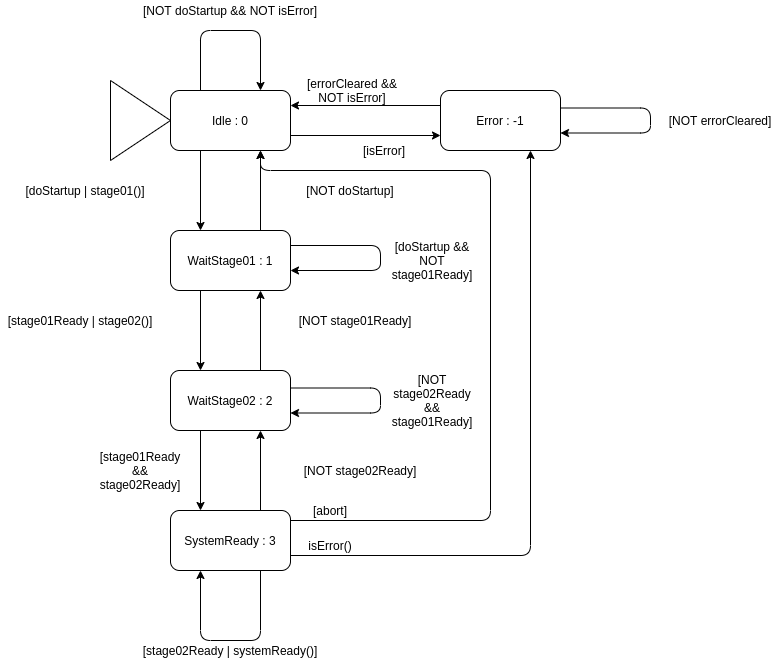

# TASK 01

## Description

Your task is to implement a statemachine which initializes a system with two initialization stages.
It first remains in idle as long as no input was given. As soon as the system gets the doStartup() signal, the statemachine shall switch to stage 01, initialize stage 01, and then wait until stage 01 has finished. The same applies to stage 02. After stage 02 is finished, the system shall be in the "system ready" state, in which it stays until either the stage02Ready signal has switched to false, or the system has received an "abort" signal, or an error occured. 

Errors can occur in the first state, the "idle" state, and in the "system ready" state. The statemachine shall then switch to the "error" state, and shall then check if the error is cleared and no new error has occured. When both conditions apply, the statemachine shall then switch to "idle".

States shall have an specific ID you can find in the diagram after the name of the state.



## Required interface

Implement you solution in the file `MB/Statemachine/src/Statemachine.c`. You will find two functions there:

```c
int StateMachine_getCurrentState(void)
{
    /** TODO: Remove return statement and implement
     * your own function
    */
    return -1;
}

void StateMachine_run(void)
{
    /** TODO: Implement you own function 
     * 
     */
}
```
The `getCurrentState()` function shall output the current state ID from the state as an integer.
The `run()` function shall do one step of the statemachine.

__WARNING!__ Please use these functions to implement your statemachine as otherwise you won't be able to run unit tests on it!

You can interact with the stage functions using the functions defined and __commented__ in [`MB/Statemachine/inc/StageControl.h`](MB/Statemachine/inc/StageControl.h).
